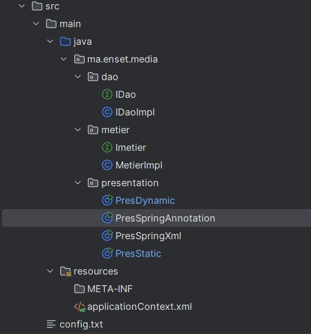
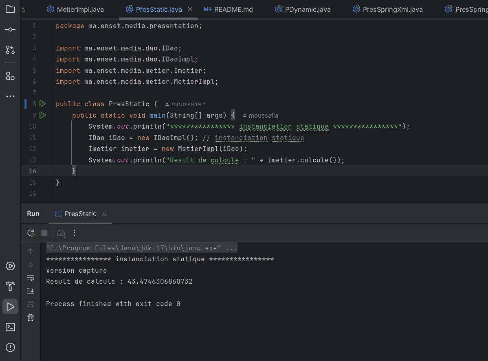
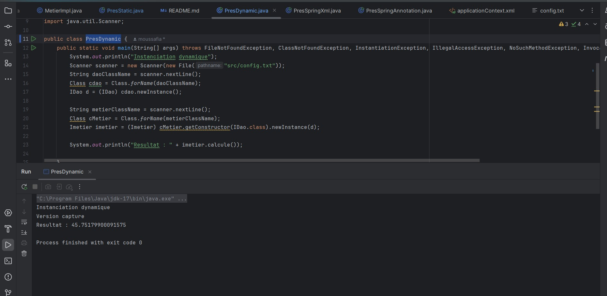
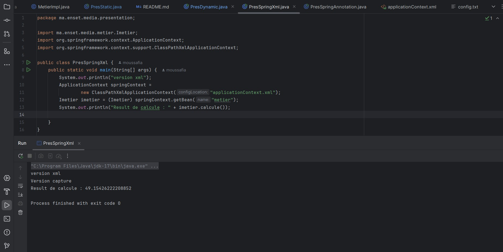
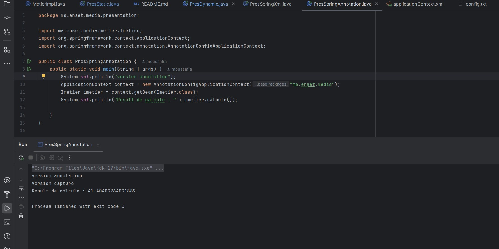

# dependency-injection

<h1>Présentation du projet</h1>

Ce projet illustre l'application de différents types d'injection de dépendances, notamment l'injection par instanciation statique et dynamique. Il explore également l'utilisation de Spring pour réaliser l'injection de dépendances via une configuration XML ou par annotations, afin de maîtriser les concepts variés de l'injection de dépendances.

<h3>Structure du projet</h2>

<h3>Injection des dépendances - Instanciation statique</h2>

<h3>Injection des dépendances - Instanciation dynamique</h2>

<h3>Injection des dépendances avec le Framework Spring</h2>
<h5>- Configuration XML</h3>

<h5>- Utilisation des annotations</h3>

